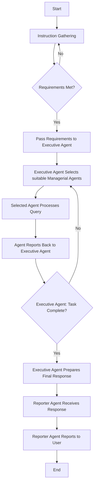

# Clique AI Assistant Service Overview

### About Clique AI

Autonomous AI-powered unification and execution company-os 
Clique is designed handle tasks like managing your calendar, email inbox, updating your CRM, sending emails,manage teams and even scheduling meetings. we’ve built an AI-powered agent that can summarize your schedule, update you on emails, and assist with any personal administration tasks, all through simple texts or voice commands. 

The agent team includes:

- Project Manager Agent
- Administrator Agent
- Marketing Agent

**The agent team can be extended by adding additional tool using create_agent to the project.**

1. [Core Concepts](#core-concepts)
2. [Prerequisites](#prerequisites)
3. [Configuration](#configuration)
4. [Setup](#setup)
5. [Usage](#usage)
6. [Roadmap](#roadmap)
7. [Further Reading](#further-reading)
8. [Integrations](#integrations)
9. [Features on the Roadmap](#features-on-the-roadmap)


## Core Concepts

Clique functions as a work/company operating system, orchestrating various agents to achieve complex goals. The system comprises four primary agent types:

1. **Executive Agents**: Oversee high-level strategies, resource allocation, and decision-making.
2. **Managerial Agents**: Focus on team management, task assignment, progress tracking, and conflict resolution.
3. **Reporter Agent**: Communicates results and updates to the user.
4. **Operational Agents**: Handle specialized tasks, such as marketing, finance, HR, or software development.


### Key Techniques

- **Router Prompting**: Leverages advanced prompting techniques for improved performance.
- **Chain of Reasoning**: Adapts the Chain-of-Reasoning approach for more coherent outputs.
- **Retrieval Augmented Generation (RAG)**: Enhances responses with relevant contextual information.
- **Knowledge Graph Generation**: Creates comprehensive knowledge graphs from web pages.

### System Workflow

1. Users interact with the Executive Agent to give intructions.
2. Finalized requirements are passed to the Managerial Agents.
3. The Managerial Agents orchestrates Operational Agents with Tool to accomplish the goal.
4. Results are passed to the Reporter Agent for user communication.


#### Workflow Diagram




## Prerequisites

1. Git
2. Docker and Docker Compose

## Requirements

The list below contains all the requirements needed to have a complete developer environment to start working on this project.
Follow the links to install or update these tools on your machine.

1. [Python 3.12+](https://www.python.org/downloads/release/python-3120/)
2. [Pyenv](https://github.com/pyenv/pyenv)
4. [Poetry](https://python-poetry.org/docs/basic-usage/)

## Installation

1. Clone the repository: 
    ```bash 
        git clone https://github.com/icodeidea/clique-ai.git
    ```
2. Get a copy of the `.env` file from the project manager
5. Install the dependencies: 
    ```bash 
    poetry install
    ```
6. Run the application: 
    ```bash 
    chainlit run assistant.py -w
    ```
7. Open the application in your browser: `http://localhost:8000`

### Confgurations

Setup the configurations for the project in the `config/config.yaml` file.

   - **Serper API Key:** Get it from [https://serper.dev/](https://serper.dev/)
   - **Serper API Key:** Get it from [https://serper.dev/](https://serper.dev/)
   - **OpenAI API Key:** Get it from [https://openai.com/](https://openai.com/)- Advised Model
   - **Gemini API Key:** Get it from [https://ai.google.dev/gemini-api](https://ai.google.dev/gemini-api) - Not currently supported
   - **Claude API Key:** Get it from [https://docs.anthropic.com/en/api/getting-started](https://docs.anthropic.com/en/api/getting-started)
   - **Groq API Key:** Get it from [https://console.groq.com/keys](https://console.groq.com/keys)

### Supported Servers and Models

- **openai** (Recommended)
  - Models:
    - `gpt-4o-2024-08-06`
    - `gpt-4o-mini-2024-07-18`

- **anthropic**
  - Models:
    - `claude-3-sonnet-20240229`

- **groq**
  - Models:
    - `llama-3.1-70b-versatile`

## Project Overview

The project is structured as follows:

1. app/chains: `a list of chains that can be used to chain runnables.`
2. app/config: `a list of application configurations`
3. app/experts: `a list of single unit agents that handle specific tasks.`
4. app/models: `a list of language models powered libs that can be used to power the AI assistant.`
5. app/nodes: `a list of graph/workflow nodes.`
6. app/tools: `a list of tools that can be used to extend the functionality of the AI assistant.`
7. app/pipelines: `a single unit workflow builder.`
8. app/prompts: `a list of all system prompts and template prompts.`
9. app/states: `a list of all workflow/graph states.`
10. app/workflows: `a list of all single unit workflows.`
11. app/utils: `a list of all helpers.`

## Guides

1. Follow the development, structure and documentation patterns of the `src/tools/webscrape.py` to build custom toolkits
2. Follow the development, structure and documentation patterns of the `src/tools/webscrape.py` to build classes 
3. Pay attention to the `constants` variables and `caching` decorators to optimize performance of class functions/methods across the project
4. Create new classes in the appropriate folders to maintain an organized codebase and project
5. After installing any new package run `` to update the dependency requirements list
6. Expose RPC functions for SDKs that do not support python runtime. use [DeepKit](https://deepkit.io/documentation/rpc) and [BunJS](https://bun.sh/) if possible.

## Git Workflow

For this project, we will be using a very simple version of the Gitflow workflow. This workflow is designed to manage the development, release, and maintenance of software projects. It provides a clear and structured approach to managing branches, releases, and feature development.

### Feature

1. Create a branch off of main branch: 
    ```bash 
    git checkout -b feature/my-feature
    ```
2. Make your changes and commit them: 
    ```bash 
    git commit -m "Add my feature"
    ```
3. Push your changes to the remote repository: 
    ```bash 
    git push origin feature/my-feature
    ```
4. Open a pull request on GitHub and request a review from a team member.
5. Once the pull request is approved, merge it into the main branch.
6. Delete the feature branch: 
    ```bash 
    git branch -d feature/my-feature
    ```
7. Update your local main branch: 
    ```bash 
    git checkout main && git pull origin main
    ```

### Bugfix

1. For bug fixes, create a branch off of main branch: `git checkout -b bugfix/my-bugfix`
2. Make your changes and commit them: `git commit -m "Fix my bug"`
3. Push your changes to the remote repository: `git push origin bugfix/my-bugfix`
4. Open a pull request on GitHub and request a review from a team member.
5. Deploy the bugfix branch to a staging environment for testing.
6. Once testing is finished, merge the pull request into the main branch.
7. Once the pull request is approved, merge it into the main branch.
8. Delete the bugfix branch: `git branch -d bugfix/my-bugfix`
9. Update your local main branch: `git checkout main && git pull origin main`

## Deployment to production

To be finalised and added

## TODO

1. Add deployment instructions
2. Setup CI/CD pipelines for automatic deployment
3. Setup and integrate `LiteLLM` instance for LLM service high availability
4. Add RPC class for remote method calls to other Clique-AI services written in other languages such as `JS`, `TS` & `GO`
5. Write enough unit tests to ensure class and function input and output correctness
